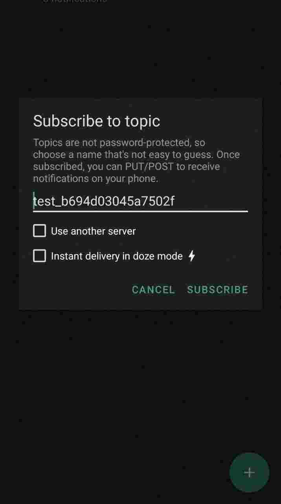
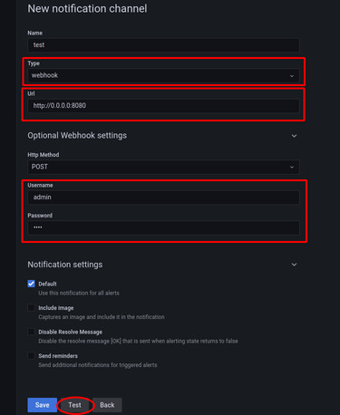
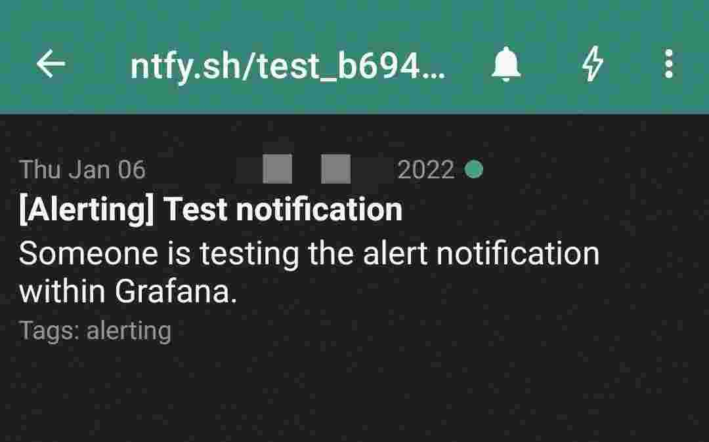

# Grafana-to-ntfy
This service is a utility webhook server for the grafana alert webhooks, which sends a notification to your ntfy url ([ntfy.sh](https://ntfy.sh/)), and consequently to your phone/desktop.  

**New:**
- [ntfy priority support](#priority-support)

### Usage
First, clone the repository or open and copy `.env.sample` file. To configure it, enter your ntfy.sh's (or your own instance's) url, the ntfy basic auth credentials (if the instance has access control enabled) and basic authorization credentials for requests from grafana. Here is an example:  
```bash
NTFY_URL=https://ntfy.sh/test_b694d03045a7502f
NTFY_BAUTH_USER=grafana     # optional (required if the ntfy instance has access control enabled)
NTFY_BAUTH_PASS=secret      # optional (required if the ntfy instance has access control enabled)
BAUTH_USER=admin
BAUTH_PASS=test
```
**Note:** ntfy.sh urls are publicly available, so, if you are not using NTFY BAUTH, better add some random string in the end to make it safer (or make the url path completely random).  
  
Then you would need to spin up the container, you can use existing Dockefile and docker-compose.yml or create your own. Just make sure that container is on the same network as grafana instance, so grafana will be able to send requests.  
  
When the service is running, you can subscribe to configured ntfy.sh topic (in this example it's `test_b694d03045a7502f`) in your phone ntfy app to test it.  
  


Now, all that's left is to open grafana and test the notifications. Enter webhook url and path as follows, and don't forget to add basic auth credentials, and finally, press `Test`:
  

  
You should instantly receive a notification:  
  

  

  
Now that you tested your notifications, you can press `Save` and configure all your system alerts.  

### Priority support

To use [ntfy prioritization](https://docs.ntfy.sh/publish/#message-priority), you need to asign label `priority` to your alert.  
Value of label can be either priority `ID` or `Name` from the doc above, so, for max priority - `max`, `urgent` or `5`.  
