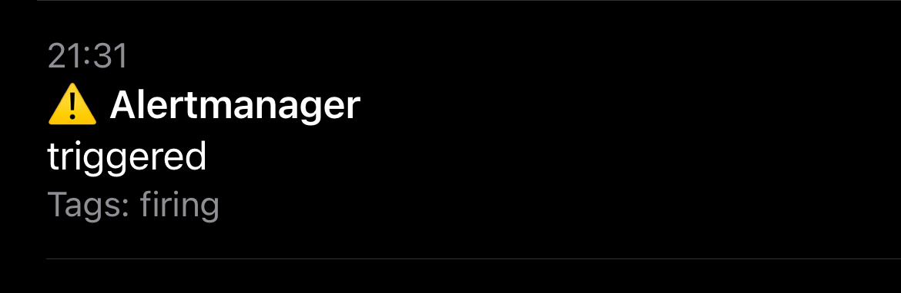

# Grafana-to-ntfy

This service is a utility webhook server for the grafana alert webhooks as well as prometheus alertmanager, which sends a notification to your ntfy url ([ntfy.sh](https://ntfy.sh/)), and consequently to your phone/desktop.

**New:**

- [ntfy priority support](#priority-support)
- [prometheus alertmanager support](#alertmanager)
- [ntfy actions support](#actions-support)
- [better ntfy tag support](#better-tag-support)
- [better annotations support](#better-annotations-support)
- [better alert support](#better-alert-support)

## Usage

First, clone the repository or open and copy `.env.sample` file. To configure it, enter your ntfy.sh's (or your own instance's) url, the ntfy basic auth credentials (if the instance has access control enabled) and basic authorization credentials for requests from grafana or alertmanager. Here is an example:

```bash
NTFY_URL=https://ntfy.sh/test_b694d03045a7502f
NTFY_BAUTH_USER=grafana     # optional (required if the ntfy instance has access control enabled)
NTFY_BAUTH_PASS=secret      # optional (required if the ntfy instance has access control enabled)
BAUTH_USER=admin
BAUTH_PASS=test
```

**Note:** ntfy.sh urls are publicly available, so, if you are not using NTFY BAUTH, better add some random string in the end to make it safer (or make the url path completely random).  
  
Then you would need to spin up the container, you can use existing Dockefile and docker-compose.yml or create your own. Just make sure that container is on the same network as grafana instance, so grafana will be able to send requests.  
  
When the service is running, you can subscribe to configured ntfy.sh topic (in this example it's `test_b694d03045a7502f`) in your phone ntfy app to test it.  


### Grafana

Now, all that's left is to open grafana and test the notifications. Enter webhook url and path as follows, and don't forget to add basic auth credentials, and finally, press `Test`:
  


You should instantly receive a notification:  
  

  

  
Now that you tested your notifications, you can press `Save` and configure all your system alerts.  

### Alertmanager

The following is a basic configuration for alertmanager. For all the options please consult the [manual](https://prometheus.io/docs/alerting/latest/configuration/#webhook_config).

```json
{
  "global": {
    "resolve_timeout": "1m",
  },
  "receivers": [
    {
      "name": "default",
      "webhook_configs": [
        {
          "http_config": {
            "basic_auth": {
              "password": "test",
              "username": "admin"
            }
          },
          "send_resolved": true,
          "url": "http://0.0.0.0:8080"
        }
      ]
    }
  ],
  "route": {
    "group_wait": "10s",
    "receiver": "default"
  }
}
```

To test the configuration you could send a test message. We assume that alertmanager is running on `127.0.0.1:9093`.

```bash
curl -H 'Content-Type: application/json' \
  -d '[{"labels":{"alertname":"myalert"}}]' http://127.0.0.1:9093/api/v2/alerts
```

After a while you should recive a notification similar to this:



## Priority support

To use [ntfy prioritization](https://docs.ntfy.sh/publish/#message-priority), you need to assign label `priority` to your alert.  
Value of label can be either priority `ID` or `Name` from the doc above, so, for max priority - `max`, `urgent` or `5`.  
In order to integrate better with [Awesome Prometheus alerts](https://samber.github.io/awesome-prometheus-alerts) we accept the
`severity` label as well. Currently, the `info` value is mapped to `low`, `warning` to `high`, `critical` to `max` 
and every other value falls back to `default`.

## Actions support

This feature is enabled by default and can be disabled by setting the env var `NTFY_ACTION_BUTTONS` to `false`.
When enabled the `X-Actions` header in the message to [ntfy](https://docs.ntfy.sh/publish/#action-buttons) will be set.
In the case of Alertmanager it will be set to the value of the `generatorURL` key.
While when using this application with Grafana we will look for the `silenceURL` key as well. 
In both cases if the annotation key `runbook_url` is set the value will be appended to the header as well. 

## Better Tag support

The labels of each message will be mapped to `key:value` as a [ntfy-tag](https://docs.ntfy.sh/publish/#tags-emojis).

## Better Annotations support

The body of each message will consist mapped key-value pairs. The key `summary` and `description` if present will be mentioned first.
Note that the `runbook_url` will be filtered out since it will be set as an action if enabled.

## Better Alert support

In the old version there was one ntfy message sent for each incoming request. 
Since Grafana as well as Alertmanager bundle multiple alerts into one notification 
we sent one ntfy message for each alert included in a request.

